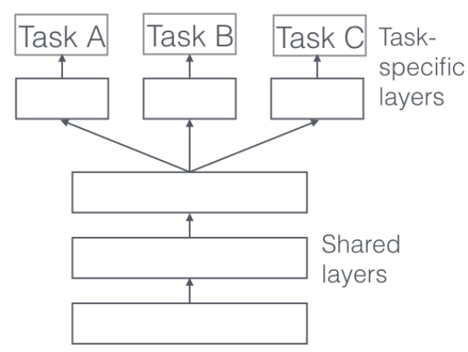
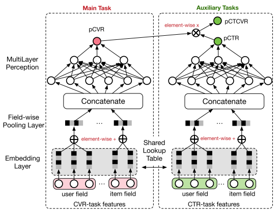
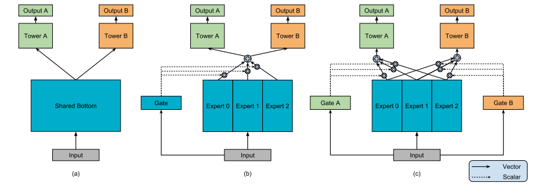
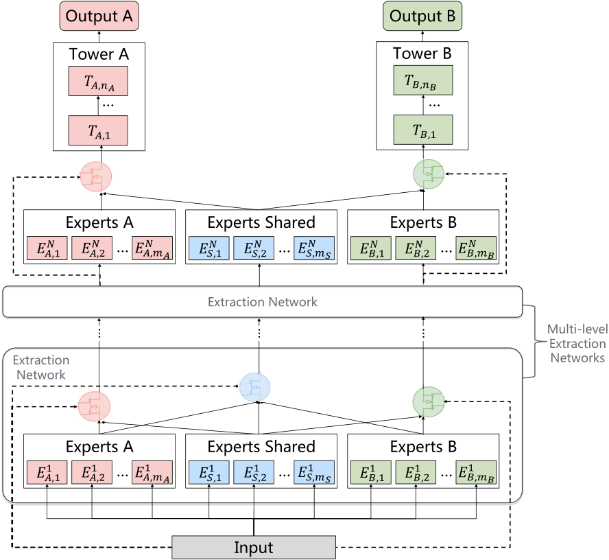

# 推荐系统之多目标学习

> 复现推荐系统中经典的多目标模型，现阶段仓库代码不完善，本人正在不断查漏补缺中

## 经典模型

### SharedBottom

论文地址：[An Overview of Multi-Task Learning in Deep Neural Networks](https://arxiv.org/abs/1706.05098)

参考代码：[DeepCTR](https://github.com/shenweichen/DeepCTR/tree/master/deepctr/models/multitask)

- 模型结构

  

### ESMM

论文地址：[Entire Space Multi-Task Model: An Effective Approach for Estimating Post-Click Conversion Rate](https://arxiv.org/abs/1804.07931)

参考代码：[DeepCTR](https://github.com/shenweichen/DeepCTR/tree/master/deepctr/models/multitask)

- 模型结构

  

### MMoE

论文地址：[Modeling Task Relationships in Multi-task Learning with Multi-gate Mixture-of-Experts](https://dl.acm.org/doi/abs/10.1145/3219819.3220007)

参考代码：[DeepCTR](https://github.com/shenweichen/DeepCTR/tree/master/deepctr/models/multitask)

- 模型结构

  

### PLE

论文地址：[Progressive Layered Extraction (PLE): A Novel Multi-Task Learning (MTL) Model for Personalized Recommendations](https://dl.acm.org/doi/abs/10.1145/3383313.3412236)

参考代码：[DeepCTR](https://github.com/shenweichen/DeepCTR/tree/master/deepctr/models/multitask)

- 模型结构

  

## 相关资料

[本人博客](https://blog.csdn.net/weixin_35154281/category_10345005.html?spm=1001.2014.3001.5482)

[DeepCTR](https://github.com/shenweichen/DeepCTR)

[DeepCTR-Torch](https://github.com/shenweichen/DeepCTR-Torch)

[推荐系统中的多任务学习](https://lumingdong.cn/multi-task-learning-in-recommendation-system.html)

[网易云音乐广告 CTR 预估模型演进过程](https://www.6aiq.com/article/1640133996814)

[Multi-task多任务学习在推荐算法中的应用](https://zhuanlan.zhihu.com/p/109835504)

[多目标排序模型在腾讯 QQ 看点推荐系统中的应用实践](https://www.6aiq.com/article/1616884898601)

[大厂技术干货 | 多目标优化及应用（含代码实现）@推荐与计算广告系列](https://www.bilibili.com/read/cv14132088)

